&nbsp;

&nbsp;

 

### Building software where **AI meets engineering.**

Production experience across **AI/ML, full-stack development, cloud infrastructure, and applied engineering systems**.

---

## `> whoami`

I'm an **AI-ML Engineer** focused on building production systems from data acquisition and model development through deployment.

My work spans:

**AI/ML** · **Backend Systems** · **Full-Stack Development** · **Cloud Infrastructure** · **MLOps**

I enjoy working across the complete lifecycle:

**Problem → Architecture → Development → Deployment → Optimization**

---

## `> current_focus`

### AI & Engineering Intelligence

Building predictive maintenance and digital twin systems using **physics-informed machine learning**, sensor data, and production software.

* Physics-informed neural networks
* Predictive maintenance
* Digital twins
* Multi-sensor data acquisition
* AI-based fault detection
* MLOps & deployment

### Production Software

Building and operating production-grade applications across frontend, backend, databases, and AWS infrastructure.

* Full-stack architecture
* Backend APIs
* Real-time data systems
* Cloud infrastructure
* Technical SEO
* Serverless architecture

---

## `> tech_stack`

### Languages

  

### AI / ML

 

`scikit-learn` · `LangChain` · `LangGraph` · `NLP` · `MLOps`

  

### Web & Application Development

 

`PyQt5` · `REST APIs` · `Serverless Architecture`

  

### Cloud & Infrastructure

 

`EC2` · `RDS` · `S3` · `ECS` · `Lambda` · `API Gateway` · `VPC` · `ELB` · `Route 53` · `CloudWatch`

  

### Databases

---

## `> selected_work`

### Industrial AI

**AI-ML Engineer · RotoAI**

Building predictive maintenance and digital twin systems for aerospace and defense applications.

* Own the sensor-to-application pipeline
* Design and train physics-informed ML models
* Built a PyQt5 predictive maintenance application
* Engineered synchronized 4-channel sensor acquisition
* Reduced system overhead by ~30%
* Reduced diagnostic turnaround by ~40%
* Developing AI-based object and fault detection

`Python` `PyTorch` `TensorFlow` `PyQt5` `MERN` `Electron.js`

---

### Production Media Platform

**Full-Stack & Cloud Engineering**

Architected and built a production media platform and custom CMS from the ground up.

* Built the platform end to end
* Designed a PERN-based backend
* Implemented serverless services with AWS
* Built real-time market data dashboards
* Managed production cloud infrastructure
* Implemented technical SEO and server-side rendering

`PostgreSQL` `Express.js` `React.js` `Node.js` `AWS`

---

### Lumina

**Reddit-Based Market Sentiment & Intelligence Engine**

Built a sentiment-analysis pipeline over live Reddit data to analyze market reception and user perception.

Designed a custom **SPIT routing algorithm** that reduced LLM API calls to **6% of requests** while maintaining matched accuracy.

`Python` `NLP` `LLM APIs` `Sentiment Analysis`

---

### CareerGuide

**AI Skill-Building Platform · EY Techathon 5.0**

Built an AI-driven skill platform combining learning resources, job-market data, speech processing, and personalized learning paths.

* Web and YouTube resource aggregation
* Job-market analysis
* Whisper speech-to-text
* NLP-based quiz generation
* LLM-driven skill paths

`MERN` `Python` `LLMs` `Whisper` `NLP`

---

### Ghoomo India

**RAG-Based Travel Itinerary Engine · Hack-Utsav 2024**

Built a RAG pipeline for personalized travel itinerary generation using retrieval optimization and prompt tuning.

`Python` `LangChain` `LLMs` `ChromaDB` `MongoDB`

---

### Deceptive-Eye

**Dark UI Pattern Detector · DPBH 2024**

Built a browser extension using supervised machine learning to detect deceptive UI patterns.

**97% classification accuracy** on the test set.

`JavaScript` `Python` `scikit-learn`

---

## `> recognition`

### 🏆 IBM ICE Day

**Winner · 2022 & 2025**

### 🌍 NASA Pale Blue Dot Visualization Challenge

**Honorable Mention · 2024**

Recognized among **1,000+ global participants**.

### 🎯 Dark Pattern Buster Hackathon

**Finalist · 2024**

Top **10 among 1,000+ nationwide entries**.

### 🥈 HACK-UTSAV

**1st Runner-Up · 2024**

2nd place among **100 competing teams**.

 

NASA climate visualization work was also featured in a publication by the U.S. Embassy in India.

---

## `> certifications`

**IBM AI Certification** · IBM · 2024

**Google Product Management** · Coursera · 2024

---

## `> education`

**B.Tech — Computer Science & Engineering**

IILM University, Greater Noida
*Specialization in Artificial Intelligence · IBM-ICE collaboration*

**2022 — 2026**

---

## `> github`

  

---

## `> currently_exploring`

`System Design`   `Cloud Infrastructure`   `AI Engineering`

`Backend Architecture`   `Distributed Systems`   `Production AI`

---

  

<i>Build systems. Understand them. Make them better.</i>

